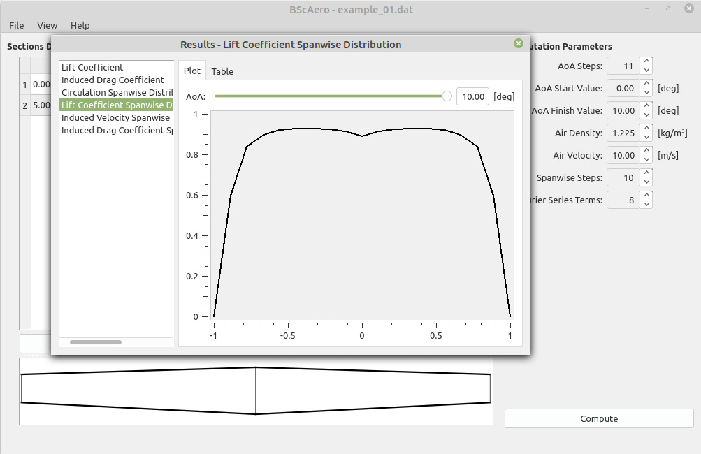

# bscaero
Software for estimating basic aerodynamics characteristics of an aircraft wing.

The Prandtl-Lanchester lifting line theory is used for computations. Input data are airfoil aerodynamic charachteristics and wing geometry. The application estimates lift and drag coefficients against angle of attack, and distribution of this coefficients along wing span. Due to limitation of lifting line theory the software can by applied for calculations of wings with aspect ratio greater than 5 and sweep angle not less than 15 degrees.

Visit [http://marekcel.pl/bscaero](http://marekcel.pl/bscaero) for more info.
